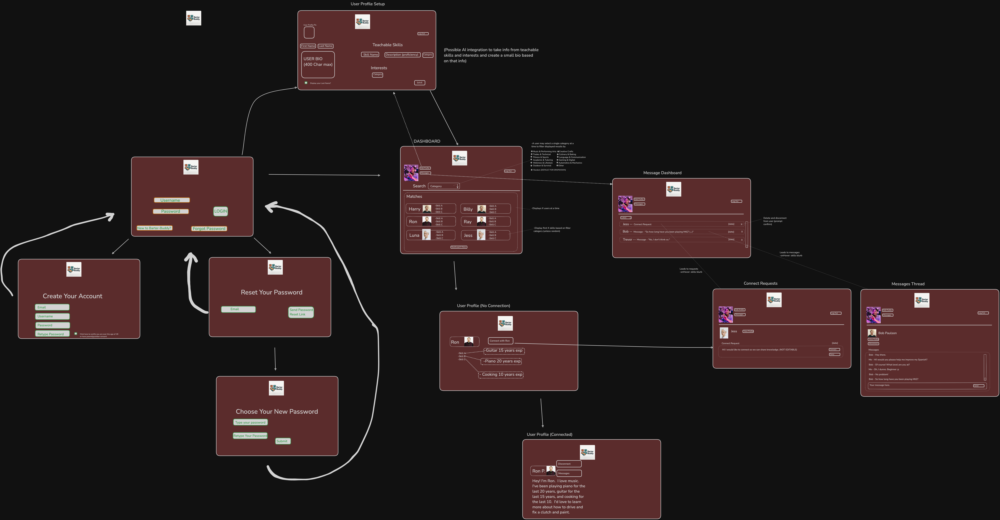

# Barter-Buddy

"A free web app that connects users in the pursuit of exchanging knowledge"

# Contributors

- Skyler McLain: Architecture Owner, Debugging Support, Software Engineer; https://github.com/shalestorm
- Ricardo Tizón: Product Owner, Team Lead, Software Engineer; https://github.com/rtizonc
- Cayla Thompson: Full-Stack Support, Mediator, Mental Health Advocate, Software Engineer; https://github.com/caylaleann
- Ti James: UI Owner, Software Engineer, UX/UI Designer; https://github.com/tiorionjames

# Project Description and Purpose

Barter Buddy is the culmination of ideas from four incredibly talented Software Engineers which posits the idea that knowledge can be shared
and skills can be learned/taught in exchange for the same. For example let's say Sam wants to learn to change the oil in his car, and knows cake decorating. Sam could match up with another user Marcus who knows how to change oil in cars but wants to learn how to decorate cakes. The purpose is to share knowledge and connect with people.

# User stories:

- A user can create an account with a profile that lists the skills they are willing to teach, and what skills category they are interested in.
- A user can view others users based on their skills (filter by skills category) or at random, and request to "connect".
- A user can see connect requests, which displays requester's offered skills, and choose to accept or decline the request.
- Connected users can send each-other messages once connected (simple messaging, messages dashboard).
- Users will be able to disconnect (one-way).
- A user will be able to rate others (after being connected) (stretch).
- Users will be able to specify availability (stretch?).
- Users will be able to reset password (stretch).
- Users will be able to filter others based on proximity, or choose online-only communication (stretch).

# Screenshots

### Docs (/docs)

This folder includes:

- capstone.png :Initial Wireframes
- ERDs for key models and relationships

## 

# List of Features Implemented

# Tech used or utilized:

# Setup:

######

# The database

The included docker-compose file will run a Postgres database server. The
following command will start the docker container and database server:

```bash
docker compose up -d
```

If you want to absolutely, positively make sure that you don't have any
problems with previous docker containers, databases, etc, run the
following commands **before** running the command above.

```bash

docker kill $(docker ps -q) #kill all running containers


docker system prune -af #remove all artifacts for all stopped containers
```

To connect to the psql shell on the database server:

```bash
docker exec -it capstone psql -U postgres
```

Create a new database for this project:

```bash
postgres=# create database barterbuddy;
```

Connect to our database:

```bash
postgres=# \c barterbuddy
```

Load the database schema:

```bash
barterbuddy=# \i server/db/schemas.sql;
```

### The FastAPI app (/backend)

Navigate to the /backend directory:

```bash
cd backend
```

This project requires these libraries:

- "fastapi[standard]"
- psycopg
- sqlalchemy

This command will run the FastAPI server:

```bash
fastapi dev main.py
```

### The React app (/frontend)

Navigate to the /frontend directory:

```bash
cd frontend
```

Install dependencies using the following command:

```bash
npm install
```

Once the dependencies are installed, you can start the development server using the following command:

```bash
npm run dev
```

You can now open your browser and go to http://localhost:5173 to see the app running!

In order to build the app for production, you can run the following command:

```bash
npm run build
```

Now you can run the app in production mode using the following command:

```bash
npm run preview
```

This will start a local server that serves the files in the dist folder, and you can open your browser and go to http://localhost:4173 to see the app running in production mode.

######

# Challenges Faced

# Lessons Learned and Team Workflow Notes

# Future Feature Ideas:

# Trello and commits link/s
