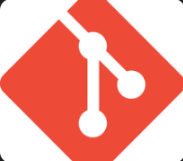
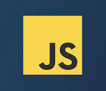
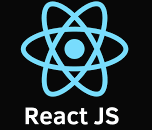

# Skill-Swap

"A free web app that connects users in the pursuit of exchanging knowledge"

## Project Description and Purpose

Skill Swap is the culmination of ideas from four incredibly talented Software Engineers which posits the idea that knowledge can be shared
and skills can be learned/taught in exchange for the same. For example let's say Sam wants to learn to change the oil in his car, and knows cake decorating. Sam could match up with another user Marcus who knows how to change oil in cars but wants to learn how to decorate cakes. The purpose is to share knowledge and connect with people.

## User stories

- As a user, I want to create an account with a profile that lists the skills I am willing to teach, and what skills I am interested in.

- As a user, I can view other users' profiles based on their skills filtering by skills category or at random, and request to connect with that user.

- As a user, I want to be able to see connect requests, which displays requester's offered skills, and choose to accept or decline the request.

- As a user, I want to connect to other users, and can send messages once connected using a simple messaging dashboard.

## Screenshots & Videos

### Docs (/docs)

This folder includes:

- capstone.png :Initial Wireframes
- ERDs for key models and relationships


## 

## 


## List of Features Implemented

- A user can create an account with a profile that lists the skills they are willing to teach, and what skills category they are interested in.
- A user can view others users based on their skills (filter by skills category) or at random, and request to "connect".
- A user can see connect requests, which displays requester's offered skills, and choose to accept or decline the request.
- Connected users can send each-other messages once connected (simple messaging, messages dashboard).

## Tech Stack

git

## 

Python3

## 

FastAPI

## 

PostgreSQL

## 

Docker

## 

JavaScript

## 

React.js

## 

React Router

## 

HTML/CSS

## 

GSAP

## 

###

## Setup

######

### The database

The included docker-compose file will run a Postgres database server. The
following command will start the docker container and database server (in root):

```bash
docker compose up -d
```

If you want to absolutely, positively make sure that you don't have any
problems with previous docker containers, databases, etc, run the
following commands **before** running the command above.

```bash

docker kill $(docker ps -q) #kill all running containers


docker system prune -af #remove all artifacts for all stopped containers
```

**You may have to manually start the docker container**

### The FastAPI app (/server)

Run the following command to activate the virtual environment:

```bash
python3 -m venv .venv
```

Run the following command to activate the virtual environment:

-On Windows:

```bash
.\\venv\\Scripts\\activate
```

-On macOS/Linux:

```bash
source .venv/bin/activate
```

To install the required libraries for this project in the root directory:

```bash
pip install -r requirements.txt
```

Navigate to the /server directory:

```bash
cd server
```

This command will run the FastAPI server:

```bash
fastapi dev main.py
```

Use Command + T to open new terminal (on a mac) or CTRL + T in Windows

### The React app (/client)

Navigate out of the server directory back to root in the new terminal window:

```bash
cd ..
```

Navigate to the /client directory:

```bash
cd client
```

Install dependencies using the following command:

```bash
npm install
```

Once the dependencies are installed, you can start the development server using the following command:

```bash
npm run dev
```

You can now open your browser and go to http://localhost:5173 to see the app running!

In order to build the app for production, you can run the following command:

```bash
npm run build
```

Now you can run the app in production mode using the following command:

```bash
npm run preview
```

This will start a local server that serves the files in the dist folder, and you can open your browser and go to http://localhost:4173 to see the app running in production mode.

